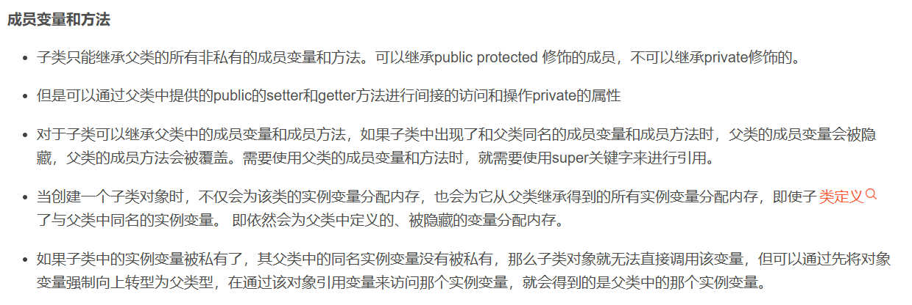
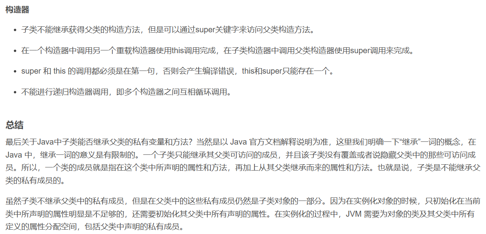

2024.8.22
面向对象
1. **内存分析**：形参和局部变量放在栈中；开辟的数组，对象放在堆中，栈中存放的是堆中对象的地址，方法区中存放的是方法的信息。另外在static中存放的是静态变量，在堆中开辟空间，对象不存在时也可以调用类的static属性和方法，案例：math类。常量池中存放的是常量。
2. **构造器的使用**，构造器的作用：创建对象，初始化对象。构造器的特点：1. 名字和类名相同；2. 没有返回值，void；3. 不能被重写，只能重载
3. **this关键字**：this代表当前对象，this可以调用成员变量和成员方法。相当于持有当前对象的引用，this可以调用成员变量和成员方法。在构造方法中，可以调用构造方法，this调用构造方法时，必须放在构造方法的首行。
4. 特别地，在构造方法中，this 可以用来调用同一个类中的另一个构造方法，这被称为构造方法链（Constructor Chaining）。但是，确实如你所说，使用 this 调用另一个构造方法时，这条语句必须作为构造方法体内的第一条语句。

这是为了确保在对象初始化过程中，对象的状态是按照**预期的顺序被设置的**。如果在调用另一个构造方法之前执行了其他操作，那么这些操作可能会基于尚**未完全初始化的对象状态**，这可能导致不可预测的行为或错误。

5. 
6. - 子类只能**继承**父类的所有非私有的成员变量和方法。可以继承public protected 修饰的成员，不可以继承private修饰的。

   - 但是可以通过父类中提供的public的setter和getter方法进行间接的访问和操作private的属性

   - 对于子类可以继承父类中的成员变量和成员方法，如果子类中出现了和父类同名的成员变量和成员方法时，父类的成员变量会被隐藏，父类的成员方法会被覆盖。需要使用父类的成员变量和方法时，就需要使用super关键字来进行引用。

   - 当创建一个子类对象时，不仅会为该类的实例变量分配内存，也会为它从父类继承得到的所有实例变量分配内存，即使子类定义了与父类中同名的实例变量。 即依然会为父类中定义的、被隐藏的变量分配内存。

   - 如果子类中的实例变量被私有了，其父类中的同名实例变量没有被私有，那么子类对象就无法直接调用该变量，但可以通过先将对象变量强制向上转型为父类型，在通过该对象引用变量来访问那个实例变量，就会得到的是父类中的那个实例变量。
   - 