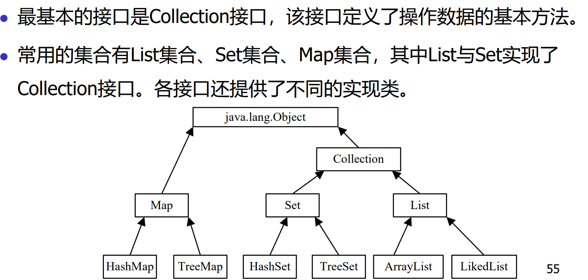
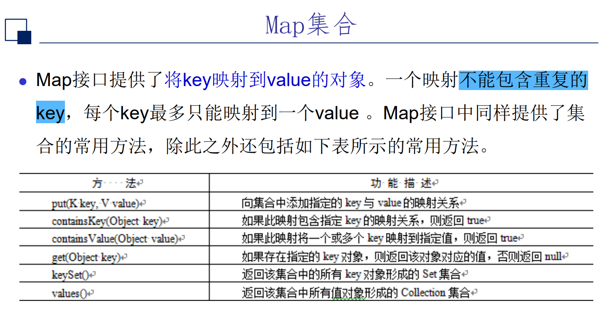
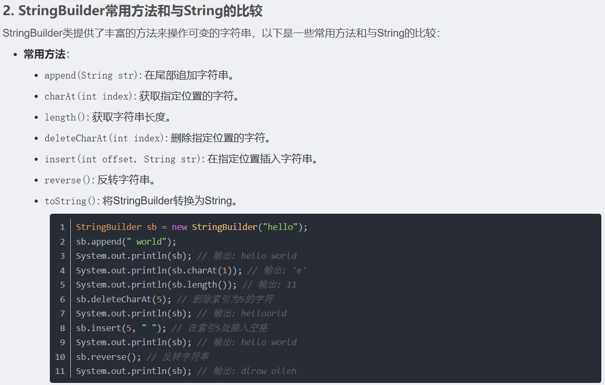

1. use map and set to solve some problems;
2. in java, Set and Map are interfaces, we always use HashSet or TreeSet to implement them;
3. 
4. 在java中，为了更好地操作string，提供了StringTokenizer类，该类可以按照指定的分隔符将字符串分割为多个部分。在Java开发和编程中，字符串是一种非常常见的数据类型，经常用于各种操作和场景，比如：
   - 字符串拼接：将多个字符串连接在一起
   - 字符串比较：判断两个字符串是否相等或大小关系
   - 字符串查找：在字符串中查找特定字符或子串
   - 字符串替换：用一个新的字符串替换原有的字符串内容
   - 字符串截取：从一个字符串中截取出部分内容
   - 字符串转换：将字符串转换为其他数据类型或格式
  
在开发中，经常会遇到需要处理字符串的情况，比如用户输入、文件读取、网络通信等。因此，熟练掌握String类的基本用法和常见操作是非常重要的。在面向对象编程中，String类的引入也符合面向对象的思想，将数据和操作数据的方法封装在一起，提高了代码的可维护性和可读性。

                        
原文链接：https://blog.csdn.net/2303_80025768/article/details/138042952
1. 

5. hashmap中的getOrdefault方法，如果key不存在，则返回默认值；
对应位置[leetcode 242](https://leetcode.cn/problems/valid-anagram/)
对应代码
```java

class Solution {
    public boolean isAnagram(String s, String t) {
        if(s.length()!=t.length()){
            return false;
        }
        else{
            int n = s.length();
            Map<Character, Integer> table = new HashMap<Character,Integer>();
            for(int i=0;i<n;i++){
                char ch = s.charAt(i);
                table.put(ch, table.getOrDefault(ch,0)+1);
            }
            for(int i=0;i<n;i++){
                char ch = t.charAt(i);
                table.put(ch, table.getOrDefault(ch,0)-1);
                if(table.get(ch)<0){
                    return false;
                }
            }
        }
        return true;
    }
}
```
对应相似题目[leetcode 383](https://leetcode.cn/problems/ransom-note/description/)