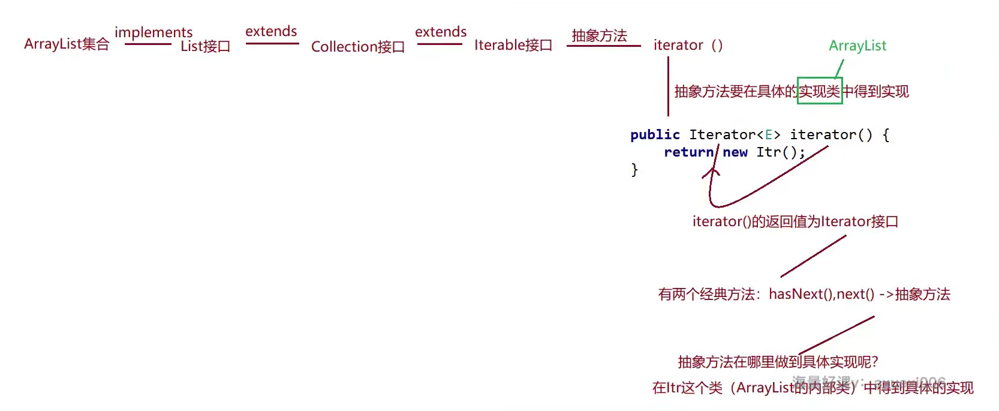
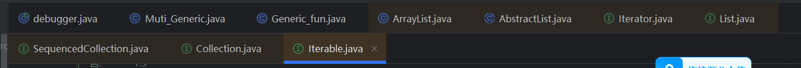
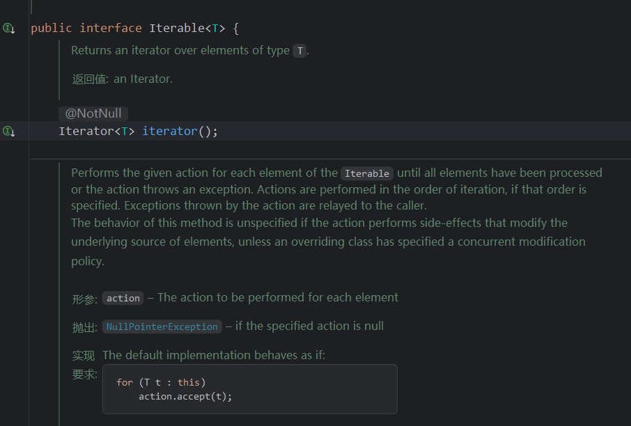
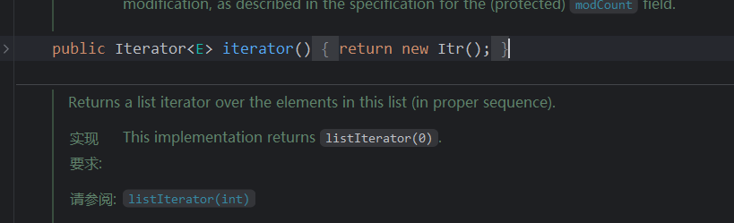
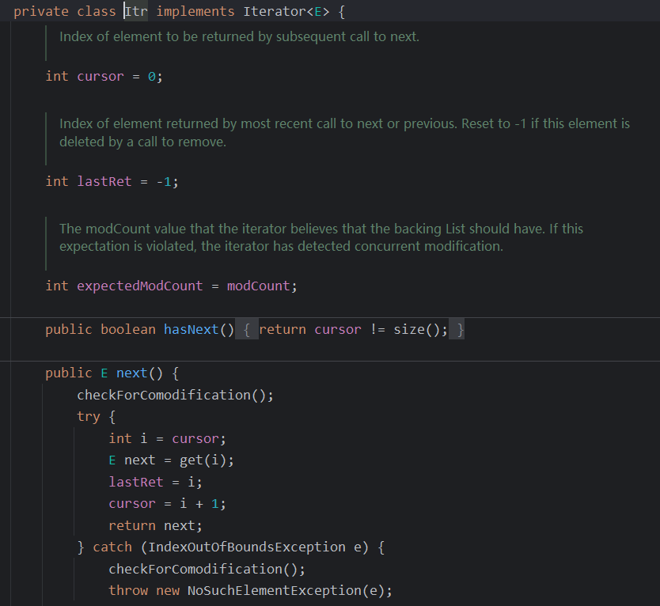

1. List接口定义的ArrayList类，其内存空间扩展的方式：
   1. 每次增加0.5倍，
   2. 每次add时检查当前元素个数是否大于等于内存空间，如果大于则增加0.5倍。其初始未加入元素时，不开辟内存空间，第一次add时，开辟10个元素的空间。
   3. arrayList，增删慢，查询快，线程不安全
   4. LinkList类，没有初始化大小，是一个双向链表，每次add时，开辟一个节点空间。
   5. LinkList，增删快，查询慢，线程不安全
2. 
   在ArrayList，是实现了List接口，List接口继承了Collection接口，Collection接口继承了Iterable接口。
   
   Iterable接口定义了iterator方法，iterator方法返回一个Iterator接口对象（在ArrayList中是Itr对象）。
   
   在ArrayList类中进行了实现，返回一个Itr对象。
   
   Itr对象是ArrayList的内部类，内部类实现了实现了Iterator接口。
   
3. hashSet，根据Comparetor接口或hashcode方法，将对象存储在数组中。comparable进行对比，放入基本数据类型的时候，封装为对象后，其中的对比是对其基本数据类型进行对比。